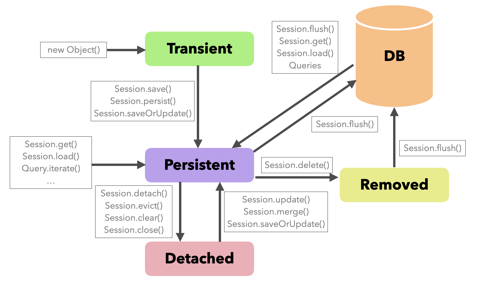

# Spring Data JPA :seedling:

Spring Data JPA Project

1. RDBMS, Java
2. ORM (Object Relational Mapping)
3. JPA 프로그래밍
    * [Entity, Value, 관계](https://wordbe.tistory.com/entry/Spring-Data-JPA-Entity-%EA%B4%80%EA%B3%84-%EB%A7%A4%ED%95%91)
    * [Lifecycle, Cascade, Fetch, Query](https://wordbe.tistory.com/entry/Spring-Data-Jpa-JPA)
4. Spring Data Common
    * [Repository, 인터페이스 정의](https://wordbe.tistory.com/entry/Spring-Data-Common-Repository)
    * [Query](https://wordbe.tistory.com/entry/Spring-Data-Common-%EC%BF%BC%EB%A6%ACQuery)
    * [Custom Repository](https://wordbe.tistory.com/entry/Spring-Data-Common-Repository-1)
    * [도메인 이벤트](https://wordbe.tistory.com/entry/Spring-Data-Common-%EB%8F%84%EB%A9%94%EC%9D%B8-%EC%9D%B4%EB%B2%A4%ED%8A%B8)
    * [QueryDSL](https://wordbe.tistory.com/entry/Spring-Data-Common-QueryDSL)
5. Spring Data Common Web 기능
    * [DomainClassConverter](https://wordbe.tistory.com/entry/Spring-Data-Common-Web-%EA%B8%B0%EB%8A%A5)
    * [Pageable, Sort](https://wordbe.tistory.com/entry/Spring-Data-Common-Web-%EA%B8%B0%EB%8A%A5)
    * [HATEOAS](https://wordbe.tistory.com/entry/Spring-Data-Common-Web-%EA%B8%B0%EB%8A%A5)
6. Spring Data JPA
    * [JpaRepository](https://wordbe.tistory.com/entry/Spring-Data-JPA-JPA-Repository-save)
    * [쿼리 메소드, Sort, Named Parameter, SpEL](https://wordbe.tistory.com/entry/Spring-Data-JPA-%EC%97%AC%EB%9F%AC-%EA%B8%B0%EB%8A%A5-1)
    * [Update](https://wordbe.tistory.com/entry/Spring-Data-JPA-%EC%97%AC%EB%9F%AC-%EA%B8%B0%EB%8A%A5-1)
    * [EntityGraph](https://wordbe.tistory.com/entry/Spring-Data-JPA-%EC%97%AC%EB%9F%AC-%EA%B8%B0%EB%8A%A5-1)
    * [Projection](https://wordbe.tistory.com/entry/Spring-Data-JPA-%EC%97%AC%EB%9F%AC-%EA%B8%B0%EB%8A%A5-2)
    * [Specifications](https://wordbe.tistory.com/entry/Spring-Data-JPA-%EC%97%AC%EB%9F%AC-%EA%B8%B0%EB%8A%A5-2)
    * [Query By Example](https://wordbe.tistory.com/entry/Spring-Data-JPA-%EC%97%AC%EB%9F%AC-%EA%B8%B0%EB%8A%A5-2)
    * [Transaction](https://wordbe.tistory.com/entry/Spring-Data-JPA-Transactional)
    * [Auditing](https://wordbe.tistory.com/entry/Spring-Data-JPA-Auditing)
    

hibernate lifecycle

